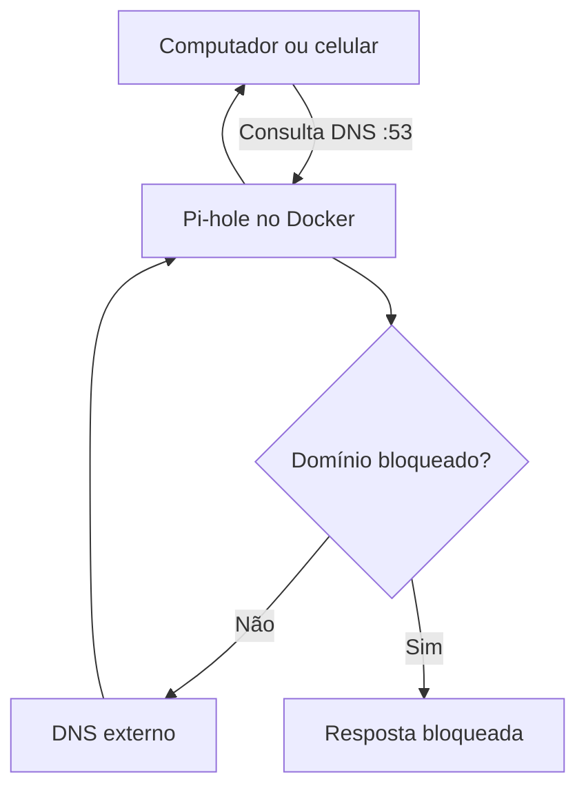

# Arquitetura do laboratório

O Pi-hole funciona como um filtro DNS. O dispositivo pergunta qual é o endereço IP
de um domínio; o Pi-hole consulta suas listas e decide se responde normalmente ou
bloqueia a resolução.

## Componentes

| Componente | Função |
|---|---|
| Docker Compose | Declara e inicia o serviço |
| `pihole/pihole:2026.05.0` | Imagem oficial usada pelo laboratório |
| Porta TCP/UDP 53 | Recebe consultas DNS |
| Porta TCP 8080 | Expõe o painel administrativo local |
| `data/etc-pihole` | Mantém configurações e bancos após recriar o contêiner |
| `.env` | Guarda senha, fuso, versão e porta sem publicar segredo |

## Escopo desta primeira fase

O Compose não habilita DHCP, não altera o roteador e não expõe o painel na
Internet. Primeiro, a consulta é enviada diretamente para `127.0.0.1`. Depois da
validação, um único equipamento pode usar o IP do host Docker como DNS. A mudança
do DNS do roteador fica para a etapa final.

## Fluxo de evolução sugerido

1. Validar o contêiner e consultas locais.
2. Testar um único computador ou celular.
3. Medir bloqueios e falsos positivos.
4. Configurar DNS primário e redundância.
5. Integrar métricas ao Grafana ou alertas ao Uptime Kuma.
